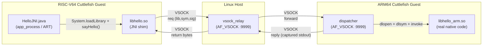

# Heterogeneous-ISA JNI Offloading Demo

A reproducible proof-of-concept that transparently executes a Java Native
Interface (JNI) call on a CPU of a **different instruction-set architecture**
than the one running the JVM. A `HelloJNI.sayHello()` invocation on a RISC-V64
Android virtual device is forwarded over `AF_VSOCK` to an ARM64 Android virtual
device, where the real native code runs, and the captured result is returned
to the original RISC-V process — all without modifying the Java application.

## Overview

A textbook Java program (`HelloJNI.java`) calls a native method through
`System.loadLibrary("hello")`. The library it loads on the RISC-V guest is
**not** the implementation of the native method — it is a *shim* that
serialises the call (library name, symbol name, JNI signature) onto a vsock
stream. A relay on the Linux host forwards the request to an ARM64 guest,
where a dispatcher process performs the actual `dlopen` + `dlsym` on the
genuine ARM-compiled `libhello_arm.so`, invokes the function, captures its
standard output, and replies. The shim hands the captured bytes back to the
JVM as the method's return value.

The Java code is unmodified between an ordinary in-process JNI run and this
cross-ISA setup; the redirection happens entirely inside the shim that the
JVM dynamically loads. This makes the demo a minimal but complete example of
heterogeneous-ISA function offloading using only stock Android, the standard
JNI ABI, and Linux AF_VSOCK.

## Architecture



The wire protocol (`proto/wire.h`) is a small framed format: a fixed header
(`magic | version | req_id | op | flags`), three length-prefixed strings
(`lib`, `sym`, `sig`), and a length-prefixed argument blob. Replies carry
`req_id | status | retdesc | ret_len + payload`. v1 only supports native
functions that do **not** dereference `JNIEnv*` or `jobject` — `sayHello()`
just calls `printf`, so passing `NULL` for both is safe.

## Repository Layout

```
.
├── README.md                  This file
├── .gitignore                 Excludes build artifacts and logs
├── setup.sh                   Builds, deploys, and starts the dispatcher + relay
├── run.sh                     Executes HelloJNI on RISC-V and collects logs
├── host/
│   └── vsock_relay.c          Host-side AF_VSOCK relay (forwards CID 3 → CID 4)
├── arm/
│   ├── dispatcher.c           ARM64 dispatcher: accepts requests, dlopens libs,
│   │                          invokes symbols, captures stdout, replies
│   └── libhello_arm.so        Pre-built ARM64 implementation of Java_HelloJNI_sayHello
├── riscv/
│   ├── libhello_shim.c        RISC-V shim: provides Java_HelloJNI_sayHello,
│   │                          which actually forwards over vsock
│   └── libhello.so            Pre-built RISC-V shim (loaded by the JVM)
├── java/
│   ├── HelloJNI.java          Java entry point (unmodified textbook JNI demo)
│   ├── HelloJNI.c             Reference native implementation (also baked
│   │                          into libhello_arm.so for the ARM side)
│   ├── HelloJNI.h             JNI header
│   └── classes.dex            Pre-built DEX (ART-loadable)
├── proto/
│   └── wire.h                 Shared wire-protocol header
└── .github/workflows/ci.yml   CI: structure + shellcheck + C syntax checks
```

All `*.so`, `dispatcher`, `vsock_relay`, `classes.dex`, and `*.class` files
are **rebuildable artifacts**; they are included only as a convenience so the
demo can run without installing the Android NDK. `setup.sh` will rebuild
everything from source when `ANDROID_NDK_HOME` is set.

## Prerequisites

- Linux host (Ubuntu 22.04 LTS or later), x86-64
- KVM enabled in BIOS/UEFI and the host kernel
- Android `adb` (from Android SDK platform-tools)
- Standard build tools: `gcc`, `make`, `git`, `clang` (host)
- (Optional, only to rebuild from source) Android NDK r27+ and Android SDK
  build-tools providing `d8`

Copy-paste install block:

```bash
sudo apt update && sudo apt install -y \
    git curl unzip wget build-essential clang make \
    qemu-kvm bridge-utils \
    android-sdk-platform-tools-common adb
```

## Installing Android Cuttlefish

[Cuttlefish](https://source.android.com/docs/devices/cuttlefish) is Google's
official virtual-device platform for running full Android system images on
Linux. It uses crosvm/QEMU under KVM and exposes each guest over `adb`, `vsock`,
and a WebRTC console. The procedure below builds Cuttlefish from source so
both ARM64 and RISC-V64 guest support is available.

**Step 1 — Verify virtualization support.** KVM must be enabled:

```bash
grep -c -w "vmx\|svm" /proc/cpuinfo
```

This must return a non-zero value. If it returns `0`, enable VT-x/AMD-V in
BIOS/UEFI and re-check.

**Step 2 — Install build dependencies:**

```bash
sudo apt update
sudo apt install -y \
    git devscripts equivs config-package-dev debhelper-compat \
    golang curl
```

**Step 3 — Build and install the Cuttlefish host packages:**

```bash
git clone https://github.com/google/android-cuttlefish
cd android-cuttlefish
tools/buildutils/build_packages.sh
sudo dpkg -i ./cuttlefish-base_*_*64.deb || sudo apt-get install -f
sudo dpkg -i ./cuttlefish-user_*_*64.deb || sudo apt-get install -f
sudo usermod -aG kvm,cvdnetwork,render "$USER"
sudo reboot
```

> **NOTE — RAM-shortage workaround.** `build_packages.sh` is RAM-heavy
> (peak ~16–20 GB) and can OOM-kill on smaller machines. On such systems,
> build each Debian package individually instead. From inside each of the
> `base/`, `frontend/`, and `user/` package folders run:
>
> ```bash
> debuild -i -us -uc -b
> ```
>
> then `sudo dpkg -i` the resulting `.deb` files in order: `base` → `user`
> (and `frontend` if you need the web UI).

**Step 4 — Download Cuttlefish images.** Obtain device images for the two
target ISAs (ARM64 and RISC-V64) and the matching host package from
<http://ci.android.com/>. From the **Artifacts** section of a recent
`aosp-main` build, download:

- `cvd-host_package.tar.gz` — host-side tooling (`cvd`, `launch_cvd`, `adb`, …)
- `aosp_cf_arm64_only_phone-img-xxxxxxx.zip` — ARM64 system image
- `aosp_cf_riscv64_phone-img-xxxxxxx.zip` — RISC-V64 system image

Decompress each archive into its own directory; both must be the same
build number for the host package to work correctly. As an alternative,
follow the official Cuttlefish documentation at
<https://source.android.com/docs/devices/cuttlefish/get-started>.

## Creating RISC-V64 and ARM64 Virtual Devices

With the host packages installed and the images downloaded, create two
instances — one per ISA — each with its own image directory:

```bash
# Run on the host
cvd create --system_image_dir <path-to-riscv-image-dir> --instance_name riscv
cvd create --system_image_dir <path-to-arm-image-dir>   --instance_name arm
```

Identify the VSOCK CID assigned to each guest from its runtime config:

```bash
# The CIDs are recorded in cuttlefish_config.json after launch.
jq '.instances[] | {name: .instance_name, cid: .vsock_guest_cid}' \
    ~/cuttlefish_runtime/cuttlefish_config.json
```

By default the demo expects RISC-V CID = 3 and ARM64 CID = 4 (the relay
hard-codes ARM CID 4 in `host/vsock_relay.c`; the shim hard-codes the host
relay address as CID 2 / port 9999 from inside any guest). If your CIDs
differ, edit the constants at the top of `host/vsock_relay.c` and
`riscv/libhello_shim.c` and rebuild, or pass matching `--vsock_guest_cid`
flags to `cvd create`.

Confirm both guests are reachable over `adb`:

```bash
adb devices
# Expected: two entries, typically 0.0.0.0:6520 (RISC-V) and 0.0.0.0:6521 (ARM)

adb -s 0.0.0.0:6520 shell getprop ro.product.cpu.abi   # → riscv64
adb -s 0.0.0.0:6521 shell getprop ro.product.cpu.abi   # → arm64-v8a
```

If the serials differ in your installation, export them before running the
demo scripts:

```bash
export ADB_RISCV_SERIAL=0.0.0.0:6520
export ADB_ARM_SERIAL=0.0.0.0:6521
```

## Building the Demo

The repository ships with pre-built binaries (`*.so`, `classes.dex`,
`dispatcher`, `vsock_relay`) so the demo can run without rebuilding. To
rebuild from source, set `ANDROID_NDK_HOME` (and optionally `ANDROID_HOME`
for `d8`) and run:

```bash
# On the host
export ANDROID_NDK_HOME=/path/to/android-ndk-r27c
export ANDROID_HOME=$HOME/Android/Sdk      # only needed for d8
./setup.sh
```

`setup.sh` produces, in this order:

| Artifact                | Toolchain                                  | Target          |
|-------------------------|--------------------------------------------|-----------------|
| `host/vsock_relay`      | host `gcc`                                 | x86_64 Linux    |
| `arm/dispatcher`        | `aarch64-linux-android34-clang` (NDK)      | ARM64 Android   |
| `arm/libhello_arm.so`   | `aarch64-linux-android34-clang` (NDK)      | ARM64 Android   |
| `riscv/libhello.so`     | `riscv64-linux-android35-clang` (NDK r27+) | RISC-V64 Android|
| `java/HelloJNI.class`   | host `javac`                               | JVM bytecode    |
| `java/classes.dex`      | `d8` from SDK build-tools                  | ART DEX         |

If `ANDROID_NDK_HOME` is unset, `setup.sh` verifies all pre-built artifacts
are present and skips the build step. If neither the NDK nor the pre-built
artifacts are available, the script fails with a clear message listing the
missing files.

## Running the Demo

End-to-end procedure, top to bottom:

```bash
# On the host: ensure both Cuttlefish VMs are running.
cvd start --instance_name riscv
cvd start --instance_name arm
adb devices   # confirm both serials are visible

# On the host: build (or skip build) and deploy.
./setup.sh    # rebuilds artifacts (if NDK is set), roots both guests,
              # disables SELinux enforcement, pushes dispatcher +
              # libhello_arm.so to ARM, pushes libhello.so + classes.dex
              # to RISC-V, starts host vsock_relay, starts ARM dispatcher.

# On the host: invoke the Java app on the RISC-V guest.
./run.sh      # tails ARM + RISC-V logcat, runs HelloJNI via app_process,
              # prints all three log streams, asserts success criteria.
```

`run.sh` performs the actual invocation by ssh-ing into the RISC-V guest
through adb and running:

```bash
# Executed inside the RISC-V guest (run.sh does this for you)
CLASSPATH=/data/local/tmp/classes.dex \
LD_LIBRARY_PATH=/data/local/tmp \
app_process -Djava.library.path=/data/local/tmp / HelloJNI
```

`app_process` is the standard ART entry point used by `zygote`; it loads
`HelloJNI` from the dex, which triggers `System.loadLibrary("hello")` →
`dlopen("libhello.so")` → the shim. The shim then issues the cross-ISA
JNI call. If `app_process` fails, the script falls back to `dalvikvm`.

## Expected Output

When successful, `run.sh` prints the three log streams it collected
(host relay, ARM dispatcher logcat, RISC-V shim logcat), followed by the
RISC-V process's stdout. A condensed, idealised trace looks like this:

```
[RISC-V JVM]        Invoking HelloJNI.sayHello()
[RISC-V Shim]       Forwarding request over VSOCK
[Host Relay]        Forwarding to ARM guest
[ARM Dispatcher]    Loading libhello_arm.so
[ARM Native]        Hello from ARM64!
[RISC-V JVM]        Result: Hello from ARM64!
```

Actual logs in `logs/` (after a run) will contain the framed wire details
— request IDs, library and symbol names, captured byte counts — for
example:

```
[relay] INVOKE req_id=1  lib=libhello_arm.so  sym=Java_HelloJNI_sayHello  sig=()V  arg_len=0  (CID3→CID4)
[relay] REPLY  req_id=1  status=0  retdesc='s'  ret_len=13  (CID4→CID3)
JNI_DISPATCHER: dlopen(libhello_arm.so) ok
JNI_DISPATCHER: dlsym(Java_HelloJNI_sayHello) ok, invoking with NULL JNIEnv/jobject
JNI_DISPATCHER: captured 13 bytes of stdout: Hello World!
JNI_SHIM:       reply ok req_id=1 retdesc='s' ret_len=13 payload: Hello World!
```

`run.sh` ends with an explicit `ALL CHECKS PASSED` line if every assertion
holds.

## Troubleshooting

**`grep -c -w "vmx\|svm" /proc/cpuinfo` returns 0.** KVM is not available.
Enable VT-x (Intel) or AMD-V in BIOS/UEFI, then verify `kvm-ok` reports
"KVM acceleration can be used".

**`build_packages.sh` is killed by OOM.** Drop down to building each Debian
package individually with `debuild -i -us -uc -b` inside `base/`, `user/`,
and `frontend/` (see the NOTE under *Installing Android Cuttlefish*). A swap
file of 16 GB+ also helps if RAM is tight.

**`adb` cannot see one of the guests.** Confirm `kvm`, `cvdnetwork`, and
`render` group membership took effect (`id $USER`); a reboot is required
after `usermod -aG`. Also confirm `cvd start` reports success and that the
guest finished booting — initial boot can take 30–90 s on slower hosts.

**`setup.sh` fails with `RISC-V CID is N, expected 3` (or ARM CID mismatch).**
Cuttlefish does not always honour `--vsock_guest_cid` predictably. Either
re-launch with explicit CIDs, or edit the CID constants in
`host/vsock_relay.c` and `riscv/libhello_shim.c` and rebuild.

**`adb root` fails.** The system image must be userdebug or eng — user
builds reject `adb root`. Re-download the correct artifact from
ci.android.com if needed.

**`socket(AF_VSOCK)` returns `EAFNOSUPPORT`.** The host kernel needs
`CONFIG_VHOST_VSOCK=y` (or the `vhost_vsock` module loaded:
`sudo modprobe vhost_vsock`). The guest kernels in stock Cuttlefish images
already include `CONFIG_VSOCKETS=y`.

**ART rejects `classes.dex` with a verification error.** Rebuild with a
matching `d8` from `${ANDROID_HOME}/build-tools/<version>/`. Mismatches
between very old `d8` and newer Cuttlefish images are the usual cause.

## Cleaning Up

```bash
# Stop the host-side daemons
kill "$(cat .relay.pid)"        2>/dev/null || true
rm -f .relay.pid .dispatcher.pid

# Stop the on-guest dispatcher
adb -s "${ADB_ARM_SERIAL:-0.0.0.0:6521}" shell pkill -f dispatcher || true

# Stop both Cuttlefish VMs
cvd stop --instance_name riscv
cvd stop --instance_name arm

# Remove rebuildable artifacts and logs
rm -f host/vsock_relay arm/dispatcher \
      arm/libhello_arm.so riscv/libhello.so \
      java/HelloJNI.class java/classes.dex
rm -rf logs/
```

## Future Work

- **Real JNI arguments.** v1 passes `NULL` for `JNIEnv*` and `jobject`,
  which is safe only for functions that don't touch them. A v2 bridge could
  marshal primitive arguments and synthesise an in-dispatcher `JNIEnv*`
  using a hosted JVM on the ARM side.
- **String and object return values.** The wire format already carries a
  `retdesc` byte (`'V'` for void, `'s'` for byte blob). Adding `'I'`/`'J'`
  for ints/longs and `'L'` for full Java objects (with a per-call serialiser)
  is straightforward.
- **Connection reuse and reconnection.** The current dispatcher opens a
  fresh connection per request from the relay; pooling would reduce per-call
  latency. A reconnection state machine (`READY → DISCONNECTED → BACKING_OFF
  → CONNECTING → READY`) would survive transient ARM-side failures
  transparently to the JVM.
- **Performance measurement.** End-to-end latency, throughput, and the
  fraction spent in vsock vs. dlopen vs. function execution have not been
  characterised.
- **Other ISA pairings.** Nothing in the design is RISC-V- or ARM-specific;
  the same mechanism should work for x86_64 ↔ ARM64 or x86_64 ↔ RISC-V64
  with only toolchain changes.

## License

This project is released under the MIT License. See `LICENSE` (TBD) for the
full text.

```
MIT License

Copyright (c) 2026 The Heterogeneous-ISA JNI Offloading Demo Authors

Permission is hereby granted, free of charge, to any person obtaining a copy
of this software and associated documentation files (the "Software"), to deal
in the Software without restriction, including without limitation the rights
to use, copy, modify, merge, publish, distribute, sublicense, and/or sell
copies of the Software, and to permit persons to whom the Software is
furnished to do so, subject to the following conditions:

The above copyright notice and this permission notice shall be included in
all copies or substantial portions of the Software.

THE SOFTWARE IS PROVIDED "AS IS", WITHOUT WARRANTY OF ANY KIND, EXPRESS OR
IMPLIED, INCLUDING BUT NOT LIMITED TO THE WARRANTIES OF MERCHANTABILITY,
FITNESS FOR A PARTICULAR PURPOSE AND NONINFRINGEMENT. IN NO EVENT SHALL THE
AUTHORS OR COPYRIGHT HOLDERS BE LIABLE FOR ANY CLAIM, DAMAGES OR OTHER
LIABILITY, WHETHER IN AN ACTION OF CONTRACT, TORT OR OTHERWISE, ARISING FROM,
OUT OF OR IN CONNECTION WITH THE SOFTWARE OR THE USE OR OTHER DEALINGS IN
THE SOFTWARE.
```
